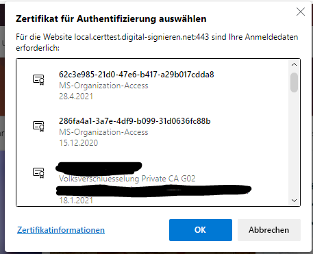

# Basic check for client certificate authorisation

Basic setup to demonstrate a client certificate authorisation with php and Apache.

## Preconditions

Use an Apache server.

Have a private (SSLCertificateFile) and public key (SSLCertificateKeyFile) for your domain.

Have bundle PEM file (SSLCACertificateFile) where all root and intermediate file of CA you consider as trusted are just concatenated.

Configure the vhost with the following parameters:

```
<VirtualHost mydomain.tld:443>

    DocumentRoot "../htdocs/inoCertTest"
    ServerName mydomain.tld

    SSLEngine on
    SSLCertificateFile "../conf/ssl.crt/mydomian.crt"
    SSLCertificateKeyFile "../conf/ssl.key/mydomian.pem"
    SSLCACertificateFile "../conf/ssl.crt/ca_bundle.crt"
    
    SSLVerifyClient optional_no_ca
    SSLVerifyDepth 4
    
    <FilesMatch "\.(cgi|shtml|phtml|php)$">
        SSLOptions +StdEnvVars
    </FilesMatch>

</VirtualHost>
```

Place the index.php file in the Document Root directory and start the Apache server.

## Usage

Just open the URL to your domain in your browser.

The browser should prompt for the client authorisation.



After OK or Cancel the action is validated and the result is displayed.